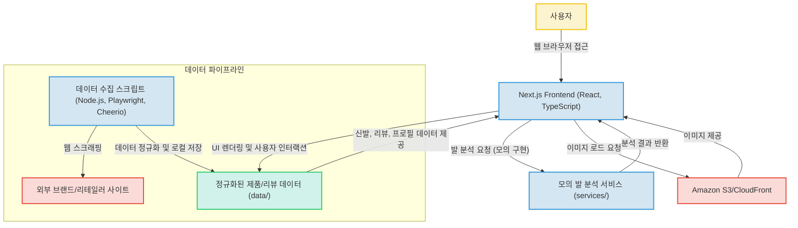

# FootMatch MVP: 발 프로필 기반 개인 맞춤형 신발 추천 서비스

## 프로젝트 소개

FootMatch MVP는 사용자의 발 프로필 분석을 기반으로 개인에게 최적화된 신발을 추천하고, 다른 사용자들의 신발 리뷰를 제공하는 웹 서비스입니다. 온라인에서 신발을 구매할 때 사이즈와 핏 때문에 겪는 어려움을 해소하고자 기획되었습니다.

본 프로젝트는 Next.js App Router를 활용한 모던 웹 프론트엔드 아키텍처로 구축되었으며, TypeScript를 전반적으로 사용하여 코드의 안정성과 유지보수성을 높였습니다. 현재 발 분석 로직은 모의(Mock) 데이터로 구현되어 있으나, 향후 실제 이미지 처리 및 AI 모델 연동을 위한 확장 가능한 구조를 갖추고 있습니다. 또한, Playwright와 Cheerio를 활용하여 외부 신발 브랜드/리테일러 사이트에서 제품 및 리뷰 데이터를 수집하고 정규화하는 초기 데이터 파이프라인을 구축하여, 데이터 기반 추천 시스템의 가능성을 보여줍니다.

## 주요 기능

*   **사용자 발 프로필 분석 (모의 데이터 기반)**: 발 사진을 입력받아 발의 형태 특성을 분석하고 사용자 발 프로필을 생성합니다. (현재는 목업 데이터로 구현되어 있습니다.)
*   **개인 맞춤형 신발 사이즈 및 모델 추천**: 생성된 발 프로필을 기반으로 사용자에게 가장 적합한 신발 사이즈와 모델을 추천합니다.
*   **신발 모델별 사용자 리뷰 제공**: 다른 사용자들의 실제 리뷰를 통해 신발 선택에 도움이 되는 정보를 제공합니다.
*   **외부 신발/리뷰 데이터 수집 파이프라인**: Playwright 및 Cheerio 스크립트를 사용하여 외부 웹사이트에서 신발 제품 및 리뷰 데이터를 스크래핑하고 정규화합니다.
*   **반응형 웹 UI**: Tailwind CSS를 활용하여 다양한 기기에서 일관되고 사용자 친화적인 경험을 제공합니다.

## 프로젝트 구조

```
.
├── app/                  # Next.js 애플리케이션의 핵심 페이지, 레이아웃 및 UI 컴포넌트
│   ├── layout.tsx        # 전역 레이아웃 정의 (Tailwind CSS 적용)
│   └── globals.css       # 전역 스타일시트
├── public/               # 정적 파일 (이미지 등)
├── scripts/              # 데이터 수집 및 유틸리티 스크립트
│   └── import-agent.ts   # 외부 웹 스크래핑 스크립트
├── services/             # 비즈니스 로직 및 외부 서비스 연동
│   └── footAnalysis.ts   # 발 분석 로직 (현재 목업 구현)
├── lib/                  # 핵심 로직 및 유틸리티 함수
│   └── profile.ts        # 발 프로필 생성, 추천 엔진 로직
├── types/                # TypeScript 사용자 정의 타입 정의
│   └── index.ts          # FootProfile, ShoeModel, ShoeReview 등
├── docs/                 # 프로젝트 관련 문서 및 계약서
│   └── asics-fitinsight-agent-contract.md # 데이터 연동 계약 문서
├── package.json          # 프로젝트 메타데이터 및 의존성 관리
└── tsconfig.json         # TypeScript 설정 파일
```

## 핵심 파일 설명

*   `package.json`: 프로젝트의 메타데이터, 개발 및 빌드 스크립트, 의존성 패키지 목록을 정의합니다. Next.js 및 React 프레임워크 기반임을 보여주며, 데이터 임포트 및 검증 관련 스크립트들이 포함되어 있습니다.
*   `app/layout.tsx`: Next.js 애플리케이션의 전역 레이아웃을 정의하며, Tailwind CSS와 같은 전역 스타일이 적용됩니다. (`app/globals.css`와 연동)
*   `services/footAnalysis.ts`: 발 사진을 입력받아 발의 형태 특성을 분석하는 비즈니스 로직을 포함합니다. 현재는 목업 데이터로 구현되어 있으나, 향후 실제 이미지 처리 및 AI 모델 연동을 위한 인터페이스 역할을 합니다.
*   `lib/profile.ts`: 사용자 발 프로필 생성 및 정규화, 다른 사용자 리뷰와의 유사성 계산, 그리고 최종 신발 사이즈 추천 로직을 담당하는 핵심 파일입니다. 프로젝트의 추천 엔진 역할을 합니다.
*   `types/index.ts`: 프로젝트 전반에서 사용되는 모든 커스텀 TypeScript 타입(예: `FootProfile`, `ShoeModel`, `ShoeReview`, `SizeRecommendation`)을 정의하여 데이터 일관성과 개발 편의성을 높입니다.
*   `scripts/import-agent.ts`: Playwright를 사용하여 외부 웹 페이지에서 신발 제품 및 리뷰 데이터를 스크래핑하고, 이를 정규화된 형식으로 변환하여 저장하는 스크립트입니다. 데이터 기반 추천 시스템의 중요한 초기 데이터 수집 파이프라인 역할을 합니다.
*   `docs/asics-fitinsight-agent-contract.md`: ASICS 데이터를 연동하는 에이전트(`import-agent`, `review-agent`)가 따라야 할 입력/출력 계약, 책임 영역, 데이터 모델 등을 정의한 문서입니다. 이는 시스템의 확장성과 데이터 처리 표준에 대한 이해를 돕습니다.

## 기술 스택

### Frontend

*   **Next.js 14.2.33**: 모던 웹 애플리케이션 개발에 필요한 풀스택 역량을 보여주며, SEO 및 성능 최적화에 대한 이해를 증명할 수 있습니다.
*   **React 18.3.1**: 컴포넌트 기반 UI 개발을 통해 재사용성과 유지보수성을 높이는 역량을 효과적으로 드러낼 수 있습니다.
*   **React-DOM 18.3.1**: React 애플리케이션을 웹 브라우저 DOM에 효율적으로 렌더링하는 핵심 기술 사용 경험을 보여줄 수 있습니다.
*   **TypeScript 5.5.3**: 정적 타입 시스템을 활용하여 대규모 프로젝트의 안정성과 개발 생산성을 향상시키는 능력을 어필할 수 있습니다.
*   **Tailwind CSS 3.4.4**: 유틸리티 우선 CSS 프레임워크를 사용하여 빠르고 일관성 있는 UI 스타일링 구현 능력을 선보일 수 있습니다.
*   **PostCSS, Autoprefixer**: CSS 전처리 및 브라우저 호환성을 위한 도구 사용 경험을 통해 현대적인 프론트엔드 개발 환경에 대한 이해를 보여줄 수 있습니다.

### Backend (Node.js 환경)

*   **Node.js**: Next.js 서버 기능 및 스크립트 실행 환경으로 JavaScript를 사용하여 서버 사이드 로직 및 스크립트를 구현하며 풀스택 개발자로서의 다재다능함을 보여줄 수 있습니다.
*   **Cheerio 1.2.0**: Node.js 환경에서 서버 측 웹 스크래핑 및 HTML 파싱 기술을 활용하여 데이터를 수집하고 처리하는 능력을 증명할 수 있습니다.
*   **Playwright 1.59.1**: E2E(End-to-End) 테스트 자동화 및 고급 웹 스크래핑 기능을 통해 웹 애플리케이션의 품질 보증 및 데이터 수집 전문성을 보여줄 수 있습니다.
*   **TypeScript 5.5.3**: 백엔드 스크립트 개발에도 타입스크립트를 사용하여 코드의 신뢰성과 협업 효율성을 높이는 역량을 강조할 수 있습니다.

### DevOps & Infrastructure

*   **ESLint**: 코드 스타일 일관성 유지 및 잠재적 오류 방지를 위한 정적 분석 도구 사용 경험을 통해 높은 코드 품질 의식을 보여줄 수 있습니다.
*   **tsx 4.21.0**: TypeScript 파일을 직접 실행하여 개발 생산성을 높이는 도구 활용 능력을 보여줄 수 있습니다.
*   **Amazon S3/CloudFront (추정)**: 클라우드 기반 정적 파일 호스팅 및 CDN을 활용하여 이미지와 같은 미디어 파일의 효율적인 관리 및 전송 최적화 능력을 어필할 수 있습니다.

## 시스템 아키텍처

FootMatch MVP는 Next.js App Router 기반의 모던 프론트엔드 애플리케이션으로, 사용자의 발 프로필 정보를 입력받아 신발 추천 및 리뷰를 제공합니다. 핵심 로직인 발 분석은 현재 모의(Mock)로 구현되어 있으며, `scripts` 디렉토리에 포함된 Playwright와 Cheerio 기반의 데이터 수집 스크립트를 통해 외부 브랜드/리테일러 사이트에서 신발 및 리뷰 데이터를 스크래핑하고 정규화하여 애플리케이션의 데이터 소스를 구축하는 데이터 파이프라인의 초기 형태를 갖추고 있습니다. 이미지는 AWS S3 및 CloudFront를 통해 제공됩니다. 전체적으로 TypeScript를 사용하여 코드의 안정성과 유지보수성을 확보했습니다.



## 실행 방법

프로젝트 실행에 대한 구체적인 가이드는 제공되지 않았습니다. 일반적으로 Next.js 프로젝트는 아래와 같은 절차로 실행됩니다. (추가 작성 필요)

1.  **저장소 클론**:
    ```bash
    git clone https://github.com/sujh0445/footmatch-mvp.git
    cd footmatch-mvp
    ```
2.  **의존성 설치**:
    ```bash
    npm install
    # 또는 yarn install
    ```
3.  **개발 서버 실행**:
    ```bash
    npm run dev
    # 또는 yarn dev
    ```
    (일반적으로 `http://localhost:3000`에서 접근 가능합니다.)
4.  **프로덕션 빌드 및 실행**:
    ```bash
    npm run build
    npm run start
    ```

## 기술 선택 이유

*   **Next.js**: 서버 사이드 렌더링(SSR), 정적 사이트 생성(SSG), API 라우트 등 풀스택 기능을 제공하여 개발 생산성을 높이고 SEO 및 성능 최적화에 용이하기 때문에 선택했습니다.
*   **React**: 컴포넌트 기반의 UI 개발을 통해 재사용성과 유지보수성을 극대화하고, 선언적인 UI 작성을 통해 복잡한 인터랙션도 효율적으로 관리할 수 있어 선택했습니다.
*   **TypeScript**: 대규모 프로젝트에서 코드의 안정성을 높이고 잠재적인 런타임 오류를 미리 방지하며, 개발 과정에서 코드의 가독성과 유지보수성을 향상시키는 데 큰 도움이 되므로 선택했습니다.
*   **Tailwind CSS**: 유틸리티 우선(utility-first) 방식으로 CSS를 작성하여 빠르고 일관된 디자인 시스템을 구축할 수 있으며, 커스텀 스타일링이 필요한 경우에도 유연하게 대응할 수 있어 선택했습니다.
*   **Node.js**: Next.js의 런타임 환경을 제공할 뿐만 아니라, JavaScript 기반의 서버 사이드 스크립트 및 API 개발에 효율적이어서 프론트엔드와 백엔드 개발의 일관성을 유지하기 위해 선택했습니다.
*   **Playwright / Cheerio**: 웹 스크래핑 시 동적 콘텐츠 처리 및 브라우저 자동화가 필요한 경우 Playwright가 강력한 기능을 제공하고, 정적 콘텐츠 파싱에는 Cheerio가 가볍고 효율적이어서 두 도구를 함께 사용하여 유연한 데이터 수집 파이프라인을 구축하기 위해 선택했습니다.
*   **ESLint**: 코드 스타일 가이드를 강제하고 잠재적인 코드 오류를 미리 발견하여 팀 프로젝트의 코드 품질을 일관되게 유지하고 개발 생산성을 높이기 위해 선택했습니다.
*   **Amazon S3 / CloudFront (추정)**: 정적 파일을 효율적으로 저장하고 글로벌 사용자에게 빠르게 전송하기 위한 안정적인 클라우드 솔루션으로, 비용 효율성과 확장성을 고려하여 선택했습니다.

## 개선 방향

본 프로젝트는 MVP 단계이며, 향후 다음과 같은 방향으로 개선 및 확장될 수 있습니다.

*   **실제 발 사진 분석 시스템 연동**: 현재 `services/footAnalysis.ts` 파일이 목업 데이터를 사용하고 있으므로, 실제 AI/ML 모델을 활용한 발 사진 분석 백엔드 서비스 또는 외부 API와 연동하여 정확한 발 형태 분석 기능을 구현할 필요가 있습니다.
*   **데이터 저장 및 관리 시스템 구축**: `types/index.ts`에 정의된 `FootProfile`, `ShoeReview` 등 핵심 데이터를 영구적으로 저장하고 관리할 수 있는 데이터베이스(예: PostgreSQL, MongoDB)를 구축하고, 이를 위한 백엔드 API를 개발해야 합니다.
*   **LLM 기반 기능 확장**: `prompts/` 디렉토리의 존재로 미루어 보아, LLM(Large Language Model)을 활용한 신발 추천 사유 설명, 리뷰 요약, 챗봇 상담 등 사용자 경험을 고도화하는 기능을 구체화하고 연동할 수 있습니다.
*   **사용자 인증 및 관리 시스템**: 회원가입, 로그인, 마이페이지 등 사용자를 식별하고 개인화된 서비스를 제공하기 위한 인증/인가 기능을 추가 구현하여 서비스의 신뢰성과 사용성을 높여야 합니다.
*   **데이터 파이프라인 자동화 및 고도화**: 현재 스크립트 기반의 데이터 수집을 주기적으로 자동화하고, 수집된 데이터의 품질 검증 및 정규화 과정을 더욱 정교하게 만들어 데이터의 신뢰성을 확보해야 합니다.
*   **UI/UX 개선 및 추가 기능 구현**: 신발 검색/필터링 기능 강화, 사용자 발 프로필 시각화, 다양한 신발 브랜드 및 모델 추가, 사용자 리뷰 작성 기능 등 전반적인 UI/UX를 개선하고 사용자 편의 기능을 확장해야 합니다.
*   **테스트 코드 작성**: 단위 테스트, 통합 테스트, E2E 테스트를 작성하여 코드의 안정성을 확보하고, 기능 변경 및 확장에 따른 사이드 이펙트를 최소화해야 합니다.